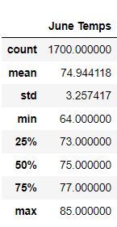
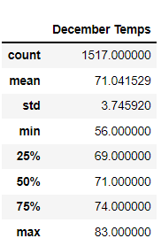

# surfs_up

## Overview of the Analysis

This project seeks to analyze temperature trends in Oahu in order to determine if its a good idea to open a new surfs shop. This project consists in two main deliverables, that analyze the temperatures for June and December to determine if the surf and ice cream shop business is sustainable year-round.

## Results

The results obtained showed that the temperature is consistent through the year. The temperature is pretty similar for both June and December. The following images show these findings. 

* The average temperature for June is 75 and 71 for December, with just a difference of 4 degrees. 
* The temperature range for June is of 21 degrees, that goes from 64 to 85 degrees. The temperature range for December if of 27 degrees, that goes from 56 to 83. 
* The variability in temperature for June is about 3 degrees and for December about 4 degrees. 

## Summary 

The previous results showed that the temperature is consistent during the year, as we can see that there is very little variation from one month to another. These results may provide helpful insights in order to determine whether or not to open the new shop. In terms of temperature, the data backups the idea that the surf and ice cream shop would be a good idea. However additional weather information can change this perspective. 

In order to analyze another weather parameter, we can create new queries to analyze the precipitation for both months.
The queries to do so, are the next ones:

### Query to determine the precipitation for June
june_precipitation=[]
june_precipitation=session.query(Measurement.date,Measurement.prcp).filter(extract('month',Measurement.date)==6).all()
june_precipitation_df= pd.DataFrame(june_precipitation,columns=['date','June Precipitation'])
june_precipitation_df.describe()

### Query to determine the precipitation for December
december_precipitation=[]
december_precipitation=session.query(Measurement.date,Measurement.prcp).filter(extract('month',Measurement.date)==6).all()
december_precipitation_df= pd.DataFrame(december_precipitation,columns=['date','December Precipitation'])
december_precipitation_df.describe()

